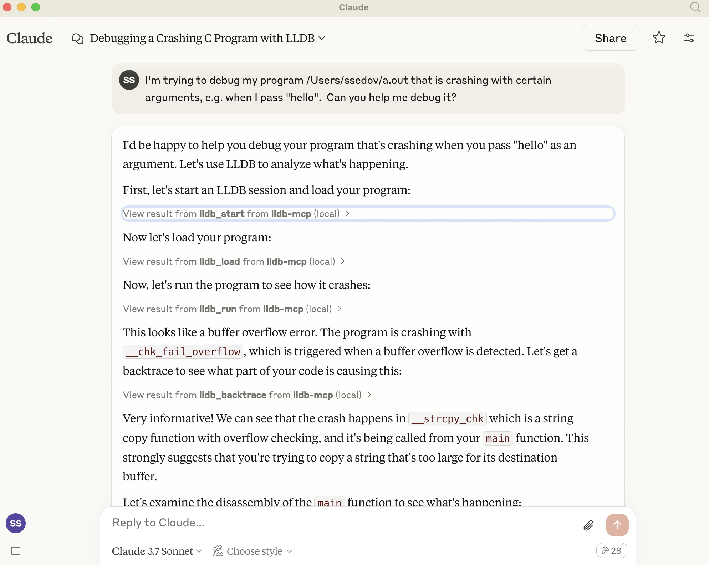

# LLDB-MCP



See it in acton here, automatically debugging a buffer overflow: https://x.com/full_duplex/status/1904770477698277847

## Overview

LLDB-MCP is a tool that integrates the LLDB debugger with Claude's Model Context Protocol (MCP). This integration allows Claude to start, control, and interact with LLDB debugging sessions directly, enabling AI-assisted debugging workflows.

The tool provides a comprehensive set of commands for working with LLDB, including:
- Starting and managing LLDB sessions
- Loading programs for debugging
- Setting breakpoints and watchpoints
- Controlling program execution
- Examining memory, registers, and variables
- Analyzing stack traces and program state

## Features

- Create and manage multiple LLDB debugging sessions
- Load executables and attach to running processes
- Load core dump files for post-mortem analysis
- Execute arbitrary LLDB commands
- Fine-grained control over program execution
- Memory examination and disassembly
- Thread and stack frame inspection

## Installation

1. Clone the repository:
   ```
   git clone https://github.com/stass/lldb-mcp.git
   cd lldb-mcp
   ```

2. Install dependencies:
   ```
   pip install mcp
   ```

3. Configure Claude to use the LLDB-MCP server:
   - Open the Claude desktop app configuration
   - Add the following to your MCP configuration:
   ```json
   "mcpServers": {
     "lldb-mcp": {
       "command": "python3",
       "args": ["/path/to/lldb-mcp/lldb_mcp.py"],
       "disabled": false
     }
   }
   ```

## Usage

Once installed and configured, you can interact with LLDB through Claude using natural language.

### Basic Workflow

1. Start a new LLDB session
2. Load a program
3. Set breakpoints
4. Run the program
5. Inspect variables and memory
6. Control execution (continue, step, next, etc.)
7. Terminate the session when done

### Example Commands

Here are some examples of how to interact with LLDB-MCP through Claude:

- "Start a new LLDB session"
- "Load the program '/path/to/executable'"
- "Set a breakpoint at main"
- "Run the program"
- "Show backtrace"
- "Print the value of variable 'count'"
- "Step over the next line"
- "Examine memory at address 0x1000"
- "Show register values"
- "Continue execution"
- "Kill the process"
- "Terminate the LLDB session"

## Supported Commands

### Session Management
- `lldb_start`: Start a new LLDB session
- `lldb_terminate`: Terminate an LLDB session
- `lldb_list_sessions`: List all active LLDB sessions

### Program Loading
- `lldb_load`: Load a program into LLDB
- `lldb_attach`: Attach to a running process
- `lldb_load_core`: Load a core dump file

### Execution Control
- `lldb_run`: Run the loaded program
- `lldb_continue`: Continue program execution
- `lldb_step`: Step to next line or instruction
- `lldb_next`: Step over function calls
- `lldb_finish`: Execute until the current function returns
- `lldb_kill`: Kill the running process

### Breakpoints and Watchpoints
- `lldb_set_breakpoint`: Set a breakpoint
- `lldb_breakpoint_list`: List all breakpoints
- `lldb_breakpoint_delete`: Delete a breakpoint
- `lldb_watchpoint`: Set a watchpoint on a variable or memory address

### Inspection
- `lldb_backtrace`: Show call stack
- `lldb_print`: Print value of expression
- `lldb_examine`: Examine memory
- `lldb_info_registers`: Display registers
- `lldb_frame_info`: Get detailed information about a stack frame
- `lldb_disassemble`: Disassemble code
- `lldb_process_info`: Get information about the current process

### Thread Management
- `lldb_thread_list`: List all threads in the current process
- `lldb_thread_select`: Select a specific thread

### Miscellaneous
- `lldb_command`: Execute an arbitrary LLDB command
- `lldb_expression`: Evaluate an expression in the current frame
- `lldb_help`: Get help for LLDB commands

## Example program

`example/overflow.c` contains an example C program that causes buffer overflow with certain arguments.
Compile it using `cc overflow.c` and ask Claude to debug the issue with the resulting program:
```
I'm trying to debug my program a.out that is crashing with certain arguments, e.g. when I pass "hello".
Can you help me debug it?
```

## Debugging Tips

- Use `lldb_command` when you need to execute LLDB commands that don't have a dedicated function
- Enable debug mode with `--debug` flag when starting the server for detailed logging
- Sessions are automatically cleaned up when the server shuts down
- Each session has a unique ID - make sure to use the correct ID when executing commands

## Requirements

- Python 3.7+
- LLDB installed on the system
- Claude desktop app with MCP support

## Troubleshooting

- If LLDB commands are timing out, check that LLDB is installed correctly
- Verify the path to LLDB when starting a new session
- Check for permission issues when attaching to processes
- Review debug logs if commands aren't executing correctly

## License

BSD 2-clause
